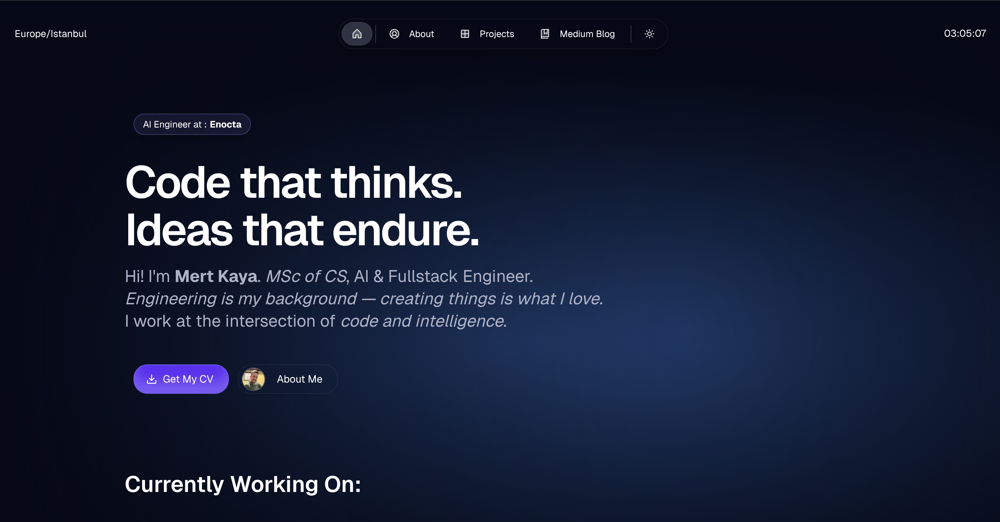
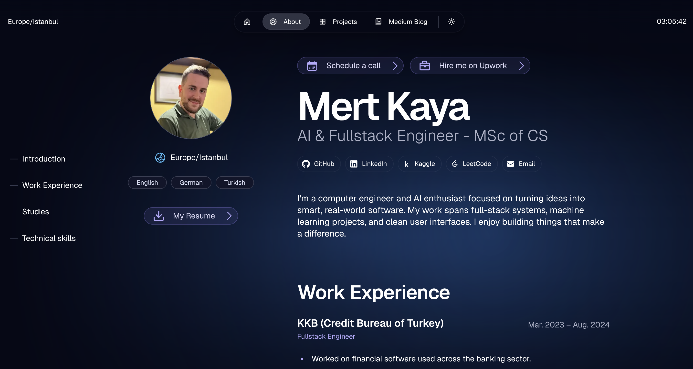
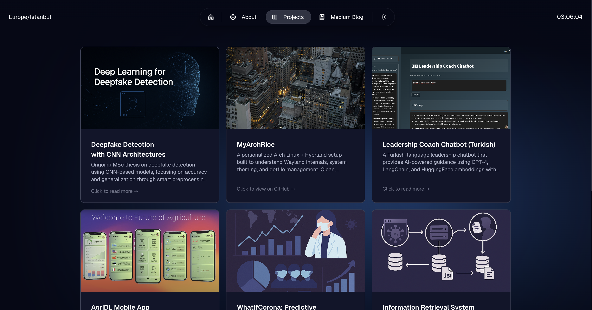

# 🧑‍💻 Mert Kaya – Personal Website

This is my personal portfolio website built with **Next.js**, **Tailwind CSS**, and **Once UI**. It showcases my CV, projects, and contact information in a clean, responsive, and multilingual-ready design.

---

## 🌐 Live Website

🔗 [https://mertkayacs.com](https://mertkayacs.com)

---

## 📸 Screenshots

### 🖥️ Home Page



### 📄 About Page



### ✉️ Projects Page



---

## 🚀 Features

- ✅ Downloadable CV
- ✅ Responsive design with dark mode
- ✅ Side navigation menu
- ✅ Contact form using Web3Forms with dynamic feedback
- ✅ Social media links (e.g., LinkedIn)
- ✅ Custom domain support (`mertkayacs.com`)
- ✅ Built with Next.js + Tailwind CSS + Once UI
- 🚧 Localization support (English, Turkish, German – in progress)

---

## 🛠️ Getting Started

1. Clone the repo:

   ```bash
   git clone https://github.com/mertkayacs/personalwebsite.git
   cd personalwebsite
   ```

2. Install dependencies:

   ```bash
   npm install
   ```

3. Run the development server:

   ```bash
   npm run dev
   ```

4. Open [http://localhost:3000](http://localhost:3000) to view it in your browser.

---

## 📦 Deployment

The site is deployed on [Vercel](https://vercel.com), optimized for Next.js.
To deploy your own fork:

1. Push to your GitHub repository.
2. Go to [vercel.com](https://vercel.com) and import the project.
3. Connect your custom domain if desired.

---

## 📬 Contact

Want to collaborate or get in touch?

- Visit [https://mertkayacs.com](https://mertkayacs.com)
- Use the contact form on the site

---

## 📄 License

This project is licensed under the MIT License.
